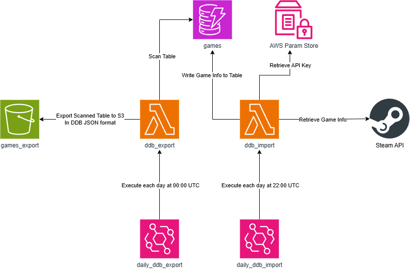

# game-repository

An AWS-based pipeline that maintains a DynamoDB table of Steam games. Two scheduled Lambda functions keep the data
fresh — one imports new games from the Steam Web API daily, and one exports a snapshot of the table to S3 for backup.

---

## Prerequisites

- [Terraform](https://developer.hashicorp.com/terraform/install) >= 1.x
- [Python](https://www.python.org/downloads/) 3.12+
- AWS credentials configured (e.g. via `aws configure` or environment variables)
- A [Steam Web API key](https://steamcommunity.com/dev)

---

## Architecture Overview



---

## AWS Resources

| Resource                                  | Description                                                       |
|-------------------------------------------|-------------------------------------------------------------------|
| `aws_dynamodb_table.games`                | `Games` table — hash key `game_id` (UUID), GSI on `steam_game_id` |
| `aws_s3_bucket.games_export`              | Snapshot bucket with versioning and lifecycle rules               |
| `aws_lambda_function.ddb_import`          | Imports new Steam games into DynamoDB                             |
| `aws_lambda_function.ddb_export`          | Exports the full table to S3 as gzipped NDJSON                    |
| `aws_scheduler_schedule.daily_ddb_import` | Triggers import Lambda at **22:00 UTC** daily                     |
| `aws_scheduler_schedule.daily_ddb_export` | Triggers export Lambda at **00:00 UTC** daily                     |
| `aws_ssm_parameter.steam_api_key`         | Steam Web API key stored as a `SecureString`                      |

---

## Import Service — Hexagonal Architecture

The `ddb_import` service is structured around hexagonal (ports & adapters) architecture:

- **Domain** (`domain/game.py`) — `Game` dataclass (`steam_game_id`, `game_title`). No framework dependencies.
- **Ports** (`ports.py`) — Abstract interfaces: `ImportGamesUseCase` (inbound), `GameSource` and `GameRepository` (
  outbound).
- **Service** (`service.py`) — `GameImportService` implements the use case. Fetches all pages from Steam, deduplicates
  against existing records using the highest known `steam_game_id` as a cursor, and writes new games in batches.
- **Adapters**:
    - `adapters/ddb_import.py` — Lambda handler; composes the service and invokes it.
    - `adapters/steam_api.py` — Retrieves the API key from SSM, delegates HTTP to `SteamHttpClient`, maps responses to
      `Game` objects.
    - `adapters/steam_http_client.py` — Builds and sends paginated requests to `IStoreService/GetAppList/v1`, logs
      request/response details (API key is redacted).
    - `adapters/dynamodb_repo.py` — Scans the `gsi_steam_game_id` GSI for deduplication, batch-writes new items using
      `GameItem` as the persistence entity.

---

## Getting Started

### 1. Configure Terraform Variables

Non-sensitive defaults are committed in `terraform/terraform.tfvars`. Create a separate file for secrets that should
**not** be committed.

### 2. Deploy

```bash
cd terraform
terraform init
terraform plan
terraform apply
```

Terraform will:

- Create the `Games` DynamoDB table
- Create the S3 snapshot bucket
- Package and deploy both Lambda functions
- Store the Steam API key in SSM Parameter Store
- Configure EventBridge schedules for both jobs

### 3. When finished destroy

```bash
terraform destroy
```
---


## Lambda Packaging

Both Lambda zip files are built automatically by Terraform's `archive_file` data source — no manual packaging step is
required.

| Lambda             | Source                                        |
|--------------------|-----------------------------------------------|
| `ddb-games-export` | `terraform/files/ddb_export.py` (single file) |
| `ddb-games-import` | `services/ddb_import/src/` (entire directory) |

---

## Terraform State

Remote state is stored in S3 with native locking:

```hcl
# terraform/backend.tf
backend "s3" {
  bucket       = "terraform-state-<12345678>"
  key          = "terraform.tfstate"
  region       = "eu-west-2"
  encrypt      = true
  use_lockfile = true
}
```

